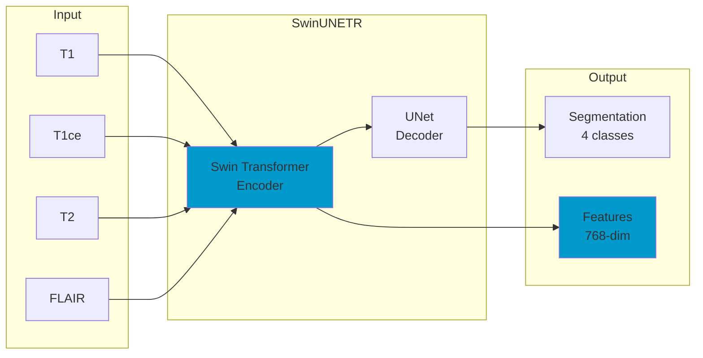

# M1 Model: MRI Encoder

## Overview

M1 is a **SwinUNETR-based** multi-task model for MRI analysis that performs:

1. **Tumor Segmentation** (4 classes)
2. **IDH Mutation Classification**
3. **Grade Classification**
4. **Survival Prediction**

## Architecture



## Model Specifications

| Parameter | Value |
|-----------|-------|
| Input Size | (4, 128, 128, 128) |
| Encoder | Swin Transformer |
| Feature Size | 48 |
| Output Features | 768-dim |
| Segmentation Classes | 4 (BG, NCR, ED, ET) |
| Parameters | ~62M |

## Segmentation Classes

| Class | Label | Description |
|-------|-------|-------------|
| 0 | Background | Non-tumor region |
| 1 | NCR/NET | Necrotic/Non-enhancing tumor core |
| 2 | ED | Peritumoral edema |
| 3 | ET | GD-enhancing tumor |

## Usage

```python
from models.m1 import MRIMultiTaskModel, M1Inference

# Initialize model
model = MRIMultiTaskModel(
    in_channels=4,
    embed_dim=48,
    include_segmentation=True
)

# Load weights
model.load_state_dict(torch.load('weights/m1_best.pth')['model_state_dict'])

# Inference
inference = M1Inference(checkpoint_path='weights/m1_best.pth')
result = inference.analyze(
    patient_id='patient_001',
    mri_path='/path/to/mri/'
)
```

## Training

```bash
python training/train_m1.py \
    --data_dir /path/to/brats \
    --output_dir ./checkpoints/m1 \
    --epochs 300 \
    --batch_size 2 \
    --lr 1e-4
```

## Performance

| Task | Metric | Score |
|------|--------|-------|
| Segmentation (WT) | Dice | 0.766 |
| IDH Classification | AUC | 0.878 |
| Grade Classification | Accuracy | 0.838 |
| Survival Prediction | C-Index | 0.660 |

## Data Preprocessing

MRI data requires preprocessing before inference:

1. **N4 Bias Field Correction**
2. **Skull Stripping** (optional)
3. **Intensity Normalization** (Z-score)
4. **Resampling** to 1mm³ isotropic
5. **Cropping** to (128, 128, 128)

```python
from preprocessing.mri_preprocessing import MRIPreprocessor

preprocessor = MRIPreprocessor(
    target_size=(128, 128, 128),
    normalize_method='zscore',
    apply_n4=True
)

result = preprocessor.process_patient('/path/to/patient_dir/')
```
