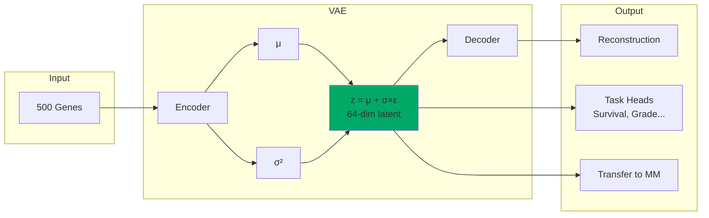

# MG Model: Gene VAE Encoder

## Overview

MG is a **Variational Autoencoder (VAE)** for gene expression analysis that:

1. Learns a compressed latent representation of gene expression
2. Predicts survival outcomes
3. Classifies tumor grade
4. Provides interpretable pathway analysis

## Architecture



## Model Specifications

| Parameter | Value |
|-----------|-------|
| Input Genes | 500 (top variable) |
| Hidden Layers | [256, 128] |
| Latent Dimension | 64 |
| Output Tasks | Survival, Grade, Recurrence |
| Loss | Reconstruction + KL + Task losses |
| Parameters | ~500K |

## VAE Loss Function

$$\mathcal{L} = \mathcal{L}_{recon} + \beta \cdot \mathcal{L}_{KL} + \lambda \cdot \mathcal{L}_{task}$$

Where:
- $\mathcal{L}_{recon}$: MSE reconstruction loss
- $\mathcal{L}_{KL}$: KL divergence from standard normal
- $\mathcal{L}_{task}$: Survival + Grade prediction losses

## Usage

```python
from models.mg import GeneExpressionCDSS, MGInference

# Initialize
mg = MGInference(checkpoint_path='weights/mg_best.pt')

# Prepare gene expression data
gene_expression = {
    'EGFR': 2.5,
    'TP53': -1.2,
    'IDH1': 0.8,
    # ... 500 genes
}

# Analyze
result = mg.analyze(
    patient_id='patient_001',
    gene_expression=gene_expression,
    include_explainability=True
)

print(f"Survival Risk: {result['survival_risk']['category']}")
print(f"Grade: {result['grade_prediction']['predicted']}")
```

## Training

```bash
python training/train_mg.py \
    --expression_file /path/to/expression.csv \
    --clinical_file /path/to/clinical.csv \
    --output_dir ./checkpoints/mg \
    --epochs 200 \
    --n_genes 500 \
    --latent_dim 64
```

## Performance

| Task | Metric | Score |
|------|--------|-------|
| Survival Prediction | C-Index | 0.780 |
| Grade Classification | Accuracy | 0.75 |
| Reconstruction | MSE | < 0.1 |

## Pathway Analysis

During inference, ssGSEA is used to compute pathway enrichment scores:

```python
# Hallmark pathways analyzed
pathways = [
    'HALLMARK_APOPTOSIS',
    'HALLMARK_CELL_CYCLE',
    'HALLMARK_DNA_REPAIR',
    'HALLMARK_GLYCOLYSIS',
    'HALLMARK_HYPOXIA',
    'HALLMARK_P53_PATHWAY',
    # ... 50 Hallmark pathways
]

# Pathway scores are used for interpretation only
# (not for training, to prevent data leakage)
```

## Gene Selection

Top 500 genes selected by variance from CGGA dataset:

1. High variance genes capture biological differences
2. Reduces noise from low-expression genes
3. Maintains key oncogenes and tumor suppressors
