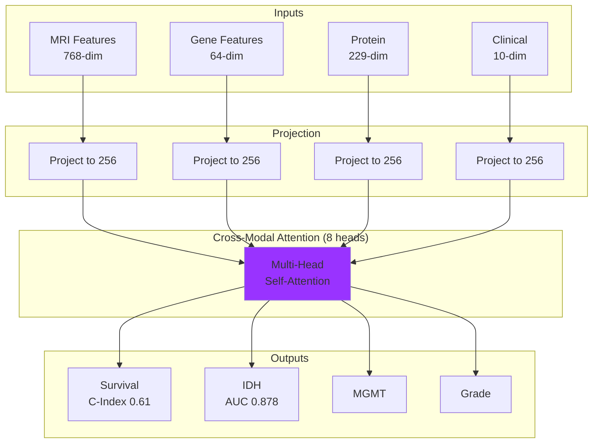

# MM Model: Multimodal Fusion

## Overview

MM is a **Cross-Modal Attention** model that fuses:

- MRI features (from M1)
- Gene expression features (from MG)
- Protein data (RPPA)
- Clinical information

## Architecture



## Model Specifications

| Parameter | Value |
|-----------|-------|
| MRI Input | 768-dim |
| Gene Input | 64-dim |
| Protein Input | 229-dim (167 RPPA) |
| Clinical Input | 10-dim |
| Hidden Dimension | 256 |
| Attention Heads | 8 |
| Output Tasks | 7 classification + survival |
| Parameters | ~2M |

## Cross-Modal Attention

The attention mechanism learns which modality combinations are informative:

```python
# Multi-head attention
attention = MultiheadAttention(
    embed_dim=256,
    num_heads=8,
    batch_first=True
)

# Stack modality embeddings as sequence
# [batch, 4, 256] - 4 modalities
modal_embeddings = torch.stack([mri, gene, protein, clinical], dim=1)

# Self-attention across modalities
attended, attention_weights = attention(
    modal_embeddings,
    modal_embeddings,
    modal_embeddings
)
```

## Usage

```python
from models.mm import MultimodalFusionModel, MMInference

# Initialize
mm = MMInference(checkpoint_path='weights/mm_best.pt')

# Predict
result = mm.predict(
    mri_features=mri_feat,      # From M1
    gene_features=gene_feat,    # From MG
    protein_data=protein_tensor,
    clinical_data=clinical_tensor
)

print(f"IDH: {result['idh_prediction']}")
print(f"MGMT: {result['mgmt_prediction']}")
print(f"Survival: {result['survival_prediction']}")
```

## Output Tasks

| Task | Classes | Metric |
|------|---------|--------|
| Grade | 4 (G1-G4) | Accuracy |
| IDH | 2 (WT/Mut) | AUC |
| MGMT | 2 (Unmeth/Meth) | AUC |
| 1p/19q | 2 (Intact/Codel) | AUC |
| Histology | 3 | Accuracy |
| Gender | 2 | Accuracy |
| Race | 3 | Accuracy |
| Survival | Continuous | C-Index |

## Performance

| Task | Metric | Score |
|------|--------|-------|
| Survival | C-Index | 0.610 |
| IDH | AUC | 0.878 |
| MGMT | AUC | 0.65 |
| Grade | Accuracy | 0.70 |

## Training

The MM model is trained with frozen M1 and MG encoders:

```python
# Freeze encoders
for param in m1_encoder.parameters():
    param.requires_grad = False
for param in mg_encoder.parameters():
    param.requires_grad = False

# Train only fusion layers
optimizer = Adam(mm_model.parameters(), lr=1e-4)
```

## Attention Visualization

```python
# Get attention weights
outputs = mm_model(mri, gene, protein, clinical, return_attention=True)

# Visualize which modalities attend to each other
attention_weights = outputs['modal_attention']  # [batch, heads, 4, 4]
```
