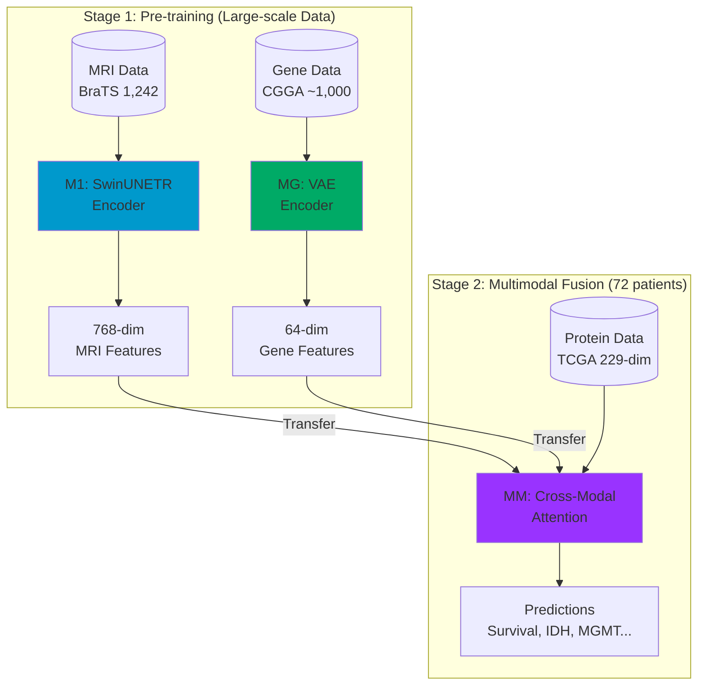

# Architecture Overview

## System Design

The Brain Tumor CDSS uses a **two-stage transfer learning** approach:



## Design Philosophy

### 1. Transfer Learning

We leverage large-scale datasets for pre-training individual modality encoders:

- **M1 (MRI)**: Pre-trained on BraTS dataset (1,242 patients)
- **MG (Gene)**: Pre-trained on CGGA dataset (~1,000 patients)

These pre-trained encoders are then frozen and used to extract features for the multimodal fusion model, which is trained on a smaller dataset (72 TCGA patients with all modalities).

### 2. Modular Architecture

Each component is designed to work independently:

| Model | Input | Output | Can Use Standalone |
|-------|-------|--------|-------------------|
| M1 | MRI (4 channels) | Segmentation + Features | Yes |
| MG | Gene Expression | Latent Features + Predictions | Yes |
| MM | All Modalities | Integrated Predictions | Requires M1, MG |

### 3. Clinical Interpretability

The system provides:

- **Segmentation masks** for tumor visualization
- **Pathway enrichment** for biological interpretation
- **Attention weights** showing modality importance
- **Confidence scores** for each prediction

## Data Flow

```
Input Data
    │
    ├─── MRI Scans ──────► M1 Encoder ──► 768-dim features
    │    (T1, T1ce,                           │
    │     T2, FLAIR)                          │
    │                                         │
    ├─── Gene Expression ► MG Encoder ──► 64-dim features
    │    (500 genes)                          │
    │                                         │
    ├─── Protein Data ────────────────────────┤
    │    (229 RPPA)                           │
    │                                         ▼
    └─── Clinical Data ──► MM Fusion ──► Predictions
         (Age, KPS, etc.)       │
                                ▼
                          ┌─────────────┐
                          │ - Grade     │
                          │ - IDH       │
                          │ - MGMT      │
                          │ - Survival  │
                          └─────────────┘
```

## Key Innovations

1. **Self-built Transfer Learning**: No external pre-trained models used; all encoders trained from scratch on domain-specific data

2. **Cross-Modal Attention**: Multi-head attention mechanism learns which modality combinations are most informative

3. **Hierarchical Predictions**: M1 and MG can make independent predictions, MM integrates them for improved accuracy

4. **Flexible Deployment**: System works with partial data (MRI-only or Gene-only modes supported)
