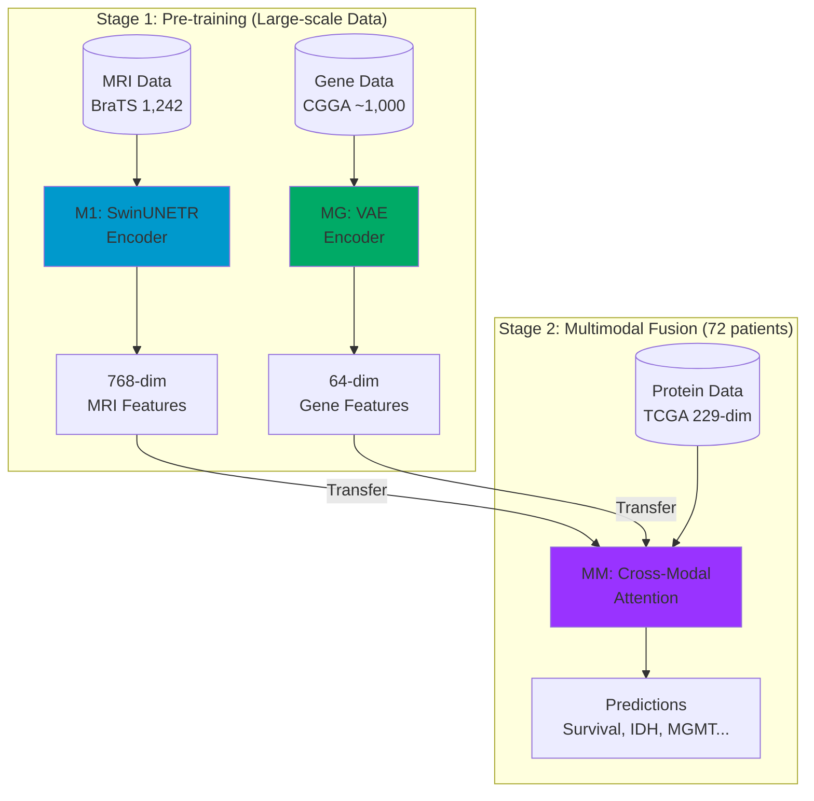

# System Architecture Diagrams

## Overall Pipeline

## M1 Model: MRI Encoder

## MG Model: Gene VAE Encoder

## MM Model: Cross-Modal Attention

## Transfer Learning Strategy

## Separation Strategy (Training vs Inference)

