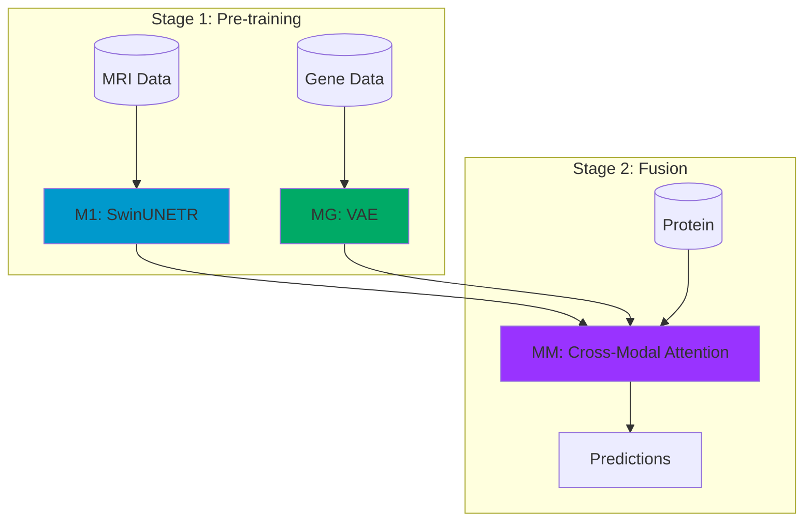

# Brain Tumor CDSS

**Clinical Decision Support System for Brain Tumor Diagnosis using Multimodal Deep Learning**

[](https://github.com/melmbrain/brain-tumor-cdss)
[](https://opensource.org/licenses/MIT)
[](https://www.python.org/)

## Overview

This project implements a **multimodal deep learning framework** for brain tumor diagnosis that integrates:

- **MRI imaging data** (T1, T1ce, T2, FLAIR)
- **Gene expression profiles** (RNA-seq)
- **Protein data** (RPPA)
- **Clinical information**

## Key Features

- **M1 Model**: SwinUNETR-based MRI encoder for segmentation and classification
- **MG Model**: VAE-based gene expression encoder
- **MM Model**: Cross-modal attention fusion for multimodal integration

## Performance

| Model | Task | Metric | Score |
|-------|------|--------|-------|
| M1-Seg | Tumor Segmentation | Dice | 0.766 |
| M1-Cls | IDH Mutation | AUC | 0.878 |
| M1-Cls | Grade Classification | Accuracy | 0.838 |
| MG | Survival Prediction | C-Index | 0.780 |
| MM | Multimodal Survival | C-Index | 0.610 |

## Quick Start

```bash
# Install
pip install brain-tumor-cdss

# Or clone and install
git clone https://github.com/melmbrain/brain-tumor-cdss.git
cd brain-tumor-cdss
pip install -e .
```

## Architecture



## Citation

If you use this work in your research, please cite:

```bibtex
@software{brain_tumor_cdss,
  author = {melmbrain},
  title = {Brain Tumor CDSS: Multimodal Deep Learning for Clinical Decision Support},
  year = {2024},
  url = {https://github.com/melmbrain/brain-tumor-cdss}
}
```

## License

This project is licensed under the MIT License - see the [LICENSE](https://github.com/melmbrain/brain-tumor-cdss/blob/main/LICENSE) file for details.
